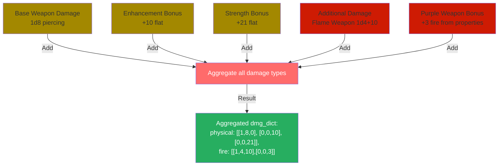

# ADOH DPS Simulator - Deep Dive: Damage Collection, Aggregation, and Simulation

**Last Updated:** January 23, 2026  
**Document Type:** Technical Deep Dive  
**Subject:** Complete damage simulation flow and mechanics  
**Audience:** Developers, contributors, maintainers

---

## Table of Contents

1. [Overview & Philosophy](#overview--philosophy)
2. [Damage Collection Phase](#damage-collection-phase)
3. [Damage Aggregation Architecture](#damage-aggregation-architecture)
4. [Damage Simulation Execution Flow](#damage-simulation-execution-flow)
5. [Per-Hit Damage Calculation](#per-hit-damage-calculation)
6. [Critical Hit Mechanics](#critical-hit-mechanics)
7. [Critical Hit Bonus Feats](#critical-hit-bonus-feats)
8. [Legendary Effect Integration](#legendary-effect-integration)
9. [Immunity Application](#immunity-application)
10. [Dual-Wield Special Cases](#dual-wield-special-cases)
11. [Non-Stackable Damage Sources](#non-stackable-damage-sources)
12. [Statistical Tracking](#statistical-tracking)
13. [Complete Example Walkthrough](#complete-example-walkthrough)

---

## Overview & Philosophy

The ADOH DPS Simulator's damage system is built on a **modular, composable architecture** where:

1. **Collection** → Gather all damage sources into unified dictionaries
2. **Aggregation** → Organize damage into type-specific lists
3. **Simulation** → Roll dice and apply modifiers per attack
4. **Accumulation** → Collect statistics across 15,000 rounds
5. **Analysis** → Calculate convergence and final DPS

**Key Philosophy:** Damage is never calculated as a single "average" value. Instead, it's **simulated per dice roll** to capture variance in critical hits, immunities, and legendary effects.

---

## Damage Collection Phase

### Step 1: Weapon Base Damage

**File:** `simulator/weapon.py` - `Weapon.__init__()`

The weapon class loads base damage from `weapons_db.py`:

```python
# weapons_db.py
WEAPON_PROPERTIES = {
    'Spear': {
        'dmg': [1, 8, 'piercing'],      # [dice, sides, damage_type]
        'threat': 20,                    # Threat range start (20 = 20-20)
        'multiplier': 2,                 # Critical hit multiplier
        'size': 'M'                      # Weapon size
    },
    'Scythe': {
        'dmg': [2, 4, 'slashing'],      # 2d4
        'threat': 20,
        'multiplier': 3,                 # Higher multiplier
        'size': 'L'                      # Large weapon
    }
}

# In Weapon class:
self.dmg = {'physical': [dice, sides, 0]}  # Normalize to [dice, sides, flat]
# Example: 1d8 piercing becomes: {'physical': [1, 8, 0]}
```

**Why "physical" consolidation?**
- NWN groups slashing/piercing/bludgeoning under a single physical damage type
- This allows immunities to apply uniformly
- Weapon damage is always recorded as `[dice, sides, flat_bonus]`

### Step 2: Enhancement Bonus Damage

**File:** `simulator/weapon.py` - `enhancement_bonus()`

Adds flat damage from weapon enhancements:

```python
def enhancement_bonus(self):
    # Example: +7 base enhancement + +3 set bonus = +10 flat damage
    enhancement_dmg = self.purple_props['enhancement'] + self.cfg.ENHANCEMENT_SET_BONUS
    
    # Organized by damage type (e.g., slashing):
    return {dmg_type: [0, 0, enhancement_dmg]}  # [0 dice, 0 sides, 10 flat]
```

**Key Point:** Enhancement damage is **flat, not rolled**. It's added as a constant to every hit.

### Step 3: Strength Bonus Damage

**File:** `simulator/weapon.py` - `strength_bonus()`

Adds flat damage from character strength:

```python
def strength_bonus(self):
    if self.cfg.TWO_HANDED:
        str_dmg = self.cfg.STR_MOD * 2  # Double strength for two-handed
    else:
        str_dmg = self.cfg.STR_MOD      # Single strength for one-handed
    
    return {'physical': [0, 0, str_dmg]}  # Flat damage, no dice
```

**Special Cases:**
- **Ranged weapons:** Strength limited by `MIGHTY` modifier (e.g., composite bow)
- **Auto-mighty throwing weapons:** Always get full STR (darts, throwing axes)
- **Dual-wield offhand:** Halved during simulation (see below)

### Step 4: Purple Weapon Bonuses

**File:** `simulator/weapon.py` - `aggregate_damage_sources()`

Loads additional bonuses from purple weapons:

```python
# weapons_db.py
PURPLE_WEAPONS = {
    'Spear_PK': {
        'enhancement': 7,               # Base enhancement
        'undead': {'enhancement': 10},  # Race-specific bonus
        'legendary': {
            'proc': 0.05,               # Proc chance (5% on hit)
            'fire': [1, 30],            # Proc damage (1d30 fire)
            'effect': 'sunder'          # Proc effect (AC reduction)
        }
    }
}
```

**Legendary weapons are handled separately** (see Legendary Effect Integration section).

### Step 5: Additional Damage Sources

**File:** `simulator/config.py` - `ADDITIONAL_DAMAGE`

User-configurable extra damage sources:

```python
ADDITIONAL_DAMAGE: {
    "Flame_Weapon":     [True, {'fire_fw': [1, 4, 10]}],      # 1d4+10 fire
    "Bane_of_Enemies":  [True, {'physical': [2, 6, 0]}],      # 2d6 physical
    "Weapon_Spec":      [False, {'physical': [0, 0, 2]}],     # +2 flat
    "Epic_Weapon_Spec": [False, {'physical': [0, 0, 4]}],     # +4 flat
    "Sneak_Attack":     [False, {'sneak': [6, 6, 0]}],        # 6d6 sneak (non-stackable)
    "Massive_Blow":     [False, {'massive': [2, 8, 0]}],      # 2d8 massive (non-stackable)
}
```

**Format:** `[enabled_flag, {damage_type: [dice, sides, flat]}]`

**Key Feature:** These are **unified into the damage dictionary** during aggregation, but **some are special-cased** to prevent stacking (see Non-Stackable section).

---

## Damage Aggregation Architecture

### The Aggregation Process

**File:** `simulator/weapon.py` - `aggregate_damage_sources()` and `simulator/damage_simulator.py` - `collect_damage_from_all_sources()`

The aggregation process consolidates all damage sources into a single dictionary structure.

### Data Flow Diagram

[](https://mermaid.live/edit#pako:eNp1k22rmzAUx79KyH253C4-1GoYF2rV-2owtsFgVUZm4gOLicQI69p-95vaTtxKfSHJ-f_-nnNizhGWinFIYK1p34CvSS6Bfbb7HMZ04OAbp72SIKEdrfmHn_r9i8NC0Ldcl62sc1hc-djyqWyoLHnHpQGxkuMw4e8cDCpBzYzuLPrFaC5r0yw51_mXSyy3Zaw1rZJULCvIBO3myhzm2xSzK7WuT6PuxQwsUnigajUHlVYd6LXquTYtH2bvrXXw_PxysplPILuUUNea19RwQIUAbKoCmEO_8MULx63Hu0hyF0nvItd3NsU_82EU5gRelyUwwLr6B2tLQ6aG-uYwtCUVBOz3DgoRLhDYY4SRM69cpyjQBF9av4L-pE-yVxT_tT-Ygz27rT0pIcjT1gtDjJdK_FDZPVSSm7JLnRh7SyV9qGQ3JcuCOIhRqYTS5KmqqiX0eoPczTYN8AKCyF7olkFi9MgR7Lju6GULjxd7Dk1j72kOiV0yqn_lMJdn6-mp_K5U99em1Vg3kFRUDHY39sz-g6SldlS6OWovMuN6p0ZpIPFDW8XlK5Ac4W9IAnflhmtvE0SuPRTfdxA8QOKGm9U6dNeuh4N15HjeGcE_U1q8inwcbTzPd_zAj6LAR5DbEVD643VKp2E9vwHpvRtY)


### Resulting Data Structure

After aggregation, the `DamageSimulator.dmg_dict` looks like:

```python
dmg_dict = {
    'physical': [
        [1, 8, 0],      # Base weapon (1d8)
        [0, 0, 10],     # Enhancement bonus
        [0, 0, 21],     # Strength bonus
        [2, 6, 0],      # Bane of Enemies
        [0, 0, 2],      # Weapon Spec
    ],
    'fire': [
        [1, 4, 10],     # Flame Weapon
        [0, 0, 3],      # Purple fire bonus
    ],
    'sneak': [
        [6, 6, 0],      # Sneak attack (if enabled)
    ],
    'massive': [
        [2, 8, 0],      # Massive blow (if enabled)
    ]
}
```

**Key Property:** Each damage type is a **list of damage dice**. This enables:
- Multiple damage sources per type (stackable)
- Special handling for non-stackable sources (sneak, massive, flame_weapon)
- Per-type immunity application

### Damage Type Organization

```python
# Physical damage unification:
if dmg_type in ['slashing', 'piercing', 'bludgeoning']:
    self.dmg_dict.setdefault('physical', []).append(dmg_entry)

# Special damage types stay separate:
# 'fire', 'cold', 'acid', 'sonic', 'positive', 'negative', 'pure',
# 'divine', 'magical', 'physical', 'sneak', 'death', 'massive', 'fire_fw'
```

---

## Damage Simulation Execution Flow

### Overview of `DamageSimulator.simulate_dps()`

The simulation is the core engine that ties everything together. It runs 15,000 rounds (or until convergence) and tracks damage per attack.

### Phase 1: Initialization (Before Loop)

```python
def simulate_dps(self):
    self.stats.init_zeroes_lists(self.attack_sim.attacks_per_round)
    
    # Store indices for dual-wield special handling
    if self.attack_sim.dual_wield:
        offhand_attack_1_idx = len(attack_prog) - 2
        offhand_attack_2_idx = len(attack_prog) - 1
        str_dmg = self.weapon.strength_bonus()
        str_idx = self.dmg_dict['physical'].index(str_dmg['physical'])
    
    # Initialize convergence tracking
    self.dps_window = deque(maxlen=15)  # Rolling 15-round window
```

### Phase 2: Main Simulation Loop

**File:** `simulator/damage_simulator.py` - `simulate_dps()` (lines ~130-230)

```
For each round (1 to 15,000):
    For each attack in attack progression:
        1. Roll d20 to determine hit/crit/miss
        2. If hit:
            a. Determine critical multiplier (1x or crit_mult)
            b. Apply legendary effects (if any)
            c. Roll all damage dice
            d. Apply immunities
            e. Accumulate damage
        3. Track statistics
```

### Phase 3: Convergence Checking (After Each Round)

```python
# After completing all attacks in a round:

# Calculate rolling 15-round DPS average
rolling_dps = total_dmg / round_num / 6

# Store in rolling window
self.dps_window.append(rolling_dps)

# Check convergence
if len(self.dps_window) >= 15:
    if self.convergence(round_num):
        break  # Simulation stable, stop early
```

---

## Per-Hit Damage Calculation

### The `get_damage_results()` Method

**File:** `simulator/damage_simulator.py` - `get_damage_results()`

This method is called **once per attack** and handles all damage rolling and immunity application.

```python
def get_damage_results(self, damage_dict: dict, imm_factors: dict):
    """
    Roll all damage dice and apply immunities in a single pass.
    
    Args:
        damage_dict: {damage_type: [[dice, sides, flat], ...], ...}
        imm_factors: {damage_type: immunity_modifier, ...} (from legendary effects)
    
    Returns:
        damage_sums: {damage_type: total_damage_this_hit, ...}
    """
    damage_sums = {}
    
    # Step 1: Roll all damage for each damage type
    for dmg_key, dmg_list in damage_dict.items():
        for dmg_sublist in dmg_list:
            # Get accumulated damage for this type (if any)
            dmg_popped = damage_sums.pop(dmg_key, 0)
            
            # Extract dice information
            num_dice = dmg_sublist[0]
            num_sides = dmg_sublist[1]
            flat_dmg = dmg_sublist[2] if len(dmg_sublist) > 2 else 0
            
            # ROLL THE DICE
            dmg_roll_results = self.attack_sim.damage_roll(
                num_dice, num_sides, flat_dmg
            )
            
            # Accumulate in the sums dictionary
            damage_sums[dmg_key] = dmg_popped + dmg_roll_results
    
    # Step 2: Apply target immunities/vulnerabilities
    damage_sums = self.attack_sim.damage_immunity_reduction(
        damage_sums, imm_factors
    )
    
    return damage_sums  # e.g., {'physical': 24, 'fire': 12}
```

### The `damage_roll()` Method

**File:** `simulator/attack_simulator.py` - `damage_roll()`

```python
@staticmethod
def damage_roll(num_dice: int, num_sides: int, flat_dmg: int):
    """Roll XdY+Z damage."""
    if num_dice == 0 or num_sides == 0:
        return flat_dmg  # No roll needed
    else:
        total = 0
        for i in range(num_dice):
            total += random.randint(1, num_sides)  # Roll each die
        return total + flat_dmg
```

### Example Execution

**Scenario:** 1d8 base + 10 enhancement + 21 STR + 1d4+10 flame weapon

```
damage_dict = {
    'physical': [[1, 8, 0], [0, 0, 10], [0, 0, 21]],
    'fire': [[1, 4, 10]]
}

Execution:
1. Roll [1, 8, 0] → 5 (1d8 roll: 5)
2. Add [0, 0, 10] → 5 + 10 = 15
3. Add [0, 0, 21] → 15 + 21 = 36 (physical total)
4. Roll [1, 4, 10] → 2 + 10 = 12 (fire total)

Result: damage_sums = {'physical': 36, 'fire': 12}
Total hit damage: 36 + 12 = 48
```

---

## Critical Hit Mechanics

### Critical Hit Flow

In NWN, **critical hits are rolled multiple times, not multiplied**:

```
Non-critical hit: Roll base damage once
Critical hit (2x): Roll base damage TWICE and add both

This is different from some RPGs that multiply the result.
```

### Critical Hit Determination

**File:** `simulator/attack_simulator.py` - `attack_roll()`

```python
def attack_roll(self, attacker_ab: int, defender_ac_modifier: int = 0):
    roll = random.randint(1, 20)
    defender_ac = self.defender_ac + defender_ac_modifier
    
    if roll == 1:
        return 'miss', roll  # Auto-miss
    elif (roll + attacker_ab) >= defender_ac or roll == 20:
        if roll >= self.weapon.crit_threat:  # In threat range?
            threat_roll = random.randint(1, 20)  # Confirm threat
            if (threat_roll + attacker_ab) >= defender_ac:
                return 'critical_hit', roll
            else:
                return 'hit', roll
        else:
            return 'hit', roll
    else:
        return 'miss', roll
```

### Critical Damage Calculation

**File:** `simulator/damage_simulator.py` - `simulate_dps()` (lines ~195-215)

```python
# Determine multiplier
crit_multiplier = 1 if outcome == 'hit' else self.weapon.crit_multiplier

# Example: weapon has 3x multiplier, so crit_multiplier = 3

# Copy damage dictionary and multiply entries
if crit_multiplier > 1:
    # Instead of multiplying damage, duplicate the dice rolls
    dmg_dict = {
        k: [i for i in v for _ in range(crit_multiplier)]
        for k, v in dmg_dict.items()
    }
    
    # Example: {'physical': [[1,8,0], [0,0,31]]} becomes
    #          {'physical': [[1,8,0], [1,8,0], [1,8,0], [0,0,31], [0,0,31], [0,0,31]]}
```

**Result:** Each damage source is **rolled 3 times** for a 3x critical.

### Non-Stackable Damage on Crits

Some damage sources don't stack on critical hits:

```python
# Remove non-stackable sources before multiplication
dmg_sneak = dmg_dict.pop('sneak', [])
dmg_sneak_max = max(dmg_sneak, key=lambda sublist: sublist[0], default=None)

dmg_death = dmg_dict.pop('death', [])
dmg_death_max = max(dmg_death, key=lambda sublist: sublist[0], default=None)

dmg_massive = dmg_dict.pop('massive', [])
dmg_massive_max = max(dmg_massive, key=get_max_dmg, default=None)

dmg_flameweap = dmg_dict.pop('fire_fw', [])
dmg_flameweap_max = max(dmg_flameweap, key=get_max_dmg, default=None)

# Roll stackable damage (gets multiplied on crit)
dmg_dict = {
    k: [i for i in v for _ in range(crit_multiplier)]
    for k, v in dmg_dict.items()
}

# Add non-stackable damage back ONCE (not multiplied)
if dmg_sneak_max is not None:
    dmg_dict.setdefault('physical', []).append(dmg_sneak_max)
    
if dmg_massive_max is not None:
    dmg_dict.setdefault('physical', []).append(dmg_massive_max)
```

---

## Critical Hit Bonus Feats

Two feats add bonus damage specifically on critical hits. These are applied **after** the critical multiplication, so they are added once (not multiplied).

### Overwhelming Critical

**Config Parameter:** `OVERWHELM_CRIT: bool = False`

Adds physical damage on critical hits based on the weapon's critical multiplier:

| Crit Multiplier | Bonus Damage |
|-----------------|--------------|
| 2x              | 1d6 physical |
| 3x              | 2d6 physical |
| 4x+             | 3d6 physical |

**Implementation:**

```python
# In simulator/damage_simulator.py - simulate_dps()
if crit_multiplier > 1:  # Only on critical hits
    if self.cfg.OVERWHELM_CRIT:
        if crit_multiplier == 2:
            overwhelm_dmg = [1, 6]      # 1d6
        elif crit_multiplier == 3:
            overwhelm_dmg = [2, 6]      # 2d6
        else:  # crit_multiplier >= 4
            overwhelm_dmg = [3, 6]      # 3d6
        dmg_dict.setdefault('physical', []).append(overwhelm_dmg)
```

### Devastating Critical

**Config Parameter:** `DEV_CRIT: bool = False`

Adds **pure damage** (bypasses all immunities) on critical hits based on weapon size:

| Weapon Size | Bonus Damage |
|-------------|--------------|
| Tiny (T)    | +10 pure     |
| Small (S)   | +10 pure     |
| Medium (M)  | +20 pure     |
| Large (L)   | +30 pure     |

**Implementation:**

```python
# In simulator/damage_simulator.py - simulate_dps()
if crit_multiplier > 1:  # Only on critical hits
    if self.cfg.DEV_CRIT:
        if self.weapon.size in ['T', 'S']:
            dev_dmg = [0, 0, 10]    # +10 pure damage
        elif self.weapon.size == 'M':
            dev_dmg = [0, 0, 20]    # +20 pure damage
        else:  # Large or larger
            dev_dmg = [0, 0, 30]    # +30 pure damage
        dmg_dict.setdefault('pure', []).append(dev_dmg)
```

### Interaction with Critical Multiplication

Both feats are applied **inside** the `if crit_multiplier > 1:` block but **after** the damage dictionary multiplication. This ensures:

1. They only trigger on critical hits
2. Their damage is not multiplied by the crit multiplier
3. They stack with each other if both are enabled

**Example:** Scimitar (2x crit) with both feats enabled:
- Base damage: 1d6 slashing → 2d6 on crit (multiplied)
- Overwhelm Crit: +1d6 physical (added once)
- Devastating Crit: +20 pure (Medium weapon, added once)

---

## Legendary Effect Integration

### Legendary Damage Source

**File:** `simulator/legend_effect.py` - `get_legend_damage()`

Legendary weapons can proc additional effects:

```python
# From weapons_db.py
'legendary': {
    'proc': 0.05,           # 5% proc chance on hit
    'fire': [1, 30],        # 1d30 fire damage
    'effect': 'sunder'      # Special effect (AC reduction)
}
```

### Proc Check

```python
def legend_proc(self, legend_proc_identifier: float):
    roll_threshold = 100 - (legend_proc_identifier * 100)
    legend_roll = random.randint(1, 100)
    
    if legend_roll > roll_threshold:  # 5% chance = threshold of 95
        self.legend_attacks_left = (
            self.attack_sim.attacks_per_round * 5  # 5-round duration
        )
        return True
    return False
```

### Legendary Damage Rolling

```python
def get_legend_damage(self, legend_dict: dict, crit_multiplier: int):
    legend_dict_sums = {}
    
    if isinstance(proc, (int, float)):  # On-hit proc
        if self.legend_proc(proc):  # 5% check succeeded
            # Roll legendary damage (using same damage_roll method)
            for dmg_type, dmg_list in legend_dict.items():
                for dmg_sublist in dmg_list:
                    dmg_roll_results = self.attack_sim.damage_roll(
                        num_dice, num_sides, flat_dmg
                    )
                    legend_dict_sums[dmg_type] = (
                        legend_dict_sums.pop(dmg_type, 0) + dmg_roll_results
                    )
    
    return legend_dict_sums, legend_dmg_common, legend_imm_factors
```

### Special Legendary Effects

```python
def ab_bonus(self):
    """Darts legendary: +2 AB for 5 rounds after proc"""
    if self.legend_attacks_left > 0 and self.weapon.name_purple == 'Darts':
        return 2
    return 0

def ac_reduction(self):
    """Sunder legendary: -2 AC to target for 5 rounds"""
    if self.legend_attacks_left > 0 and self.weapon.name_purple in [...]:
        return -2
    return 0
```

---

## Immunity Application

### Damage Immunity Reduction

**File:** `simulator/attack_simulator.py` - `damage_immunity_reduction()`

Immunities reduce damage AFTER rolling using floor-based calculation:

```python
def damage_immunity_reduction(self, damage_sums: dict, imm_factors: dict):
    """
    Apply target immunities to all damage types.
    Uses floor-based calculation with minimum 1 damage reduction.
    
    Example: 25% physical immunity on 45 damage
    Reduction: floor(45 × 0.25) = 11
    Final: 45 - 11 = 34 (NOT 45 × 0.75 = 33.75)
    """
    target_imms = deepcopy(self.cfg.TARGET_IMMUNITIES)
    
    # Apply legendary immunity modifications (e.g., Crushing Blow -5%)
    for dmg_type_name, imm_factor in imm_factors.items():
        current_imm = target_imms[dmg_type_name]
        target_imms[dmg_type_name] = current_imm + imm_factor
    
    # Apply immunities to damage sums
    for dmg_type_name, dmg_value in damage_sums.items():
        # Map fire_fw to fire, slashing/piercing/bludgeoning to physical
        corrected_dmg_type_name = {
            'fire_fw': 'fire',
            'slashing': 'physical',
            'piercing': 'physical',
            'bludgeoning': 'physical'
        }.get(dmg_type_name, dmg_type_name)
        
        if target_imms[corrected_dmg_type_name] > 0:  # Damage Immunity
            dmg_reduced = floor(dmg_value * target_imms[corrected_dmg_type_name])
            dmg_reduced = max(1, dmg_reduced)  # Minimum 1 damage reduction
            dmg_after_immunity = max(0, dmg_value - dmg_reduced)
        
        elif target_imms[corrected_dmg_type_name] < 0:  # Damage Vulnerability
            dmg_added = floor(abs(dmg_value * target_imms[corrected_dmg_type_name]))
            dmg_after_immunity = dmg_value + dmg_added
        
        else:  # No immunity or vulnerability
            dmg_after_immunity = dmg_value
        
        damage_sums[dmg_type_name] = dmg_after_immunity
    
    return damage_sums
```

### Immunity Configuration

**File:** `simulator/config.py`

```python
TARGET_IMMUNITIES: Dict[str, float] = {
    "pure": 0.0,          # No immunity to pure damage
    "magical": 0.1,       # 10% magical immunity
    "positive": 0.1,      # 10% positive energy immunity
    "divine": 0.1,        # 10% divine immunity
    "negative": 0.25,     # 25% negative energy immunity
    "sonic": 0.25,        # 25% sonic immunity
    "acid": 0.25,         # 25% acid immunity
    "electrical": 0.25,   # 25% electrical immunity
    "cold": 0.25,         # 25% cold immunity
    "fire": 0.25,         # 25% fire immunity
    "physical": 0.25,     # 25% physical immunity
}
```

### Example Immunity Calculation

```
Damage roll: physical = 45, fire = 20
Target immunities: physical = 0.25 (25%), fire = 0.25 (25%)

Physical damage after immunity:
  Reduction = floor(45 × 0.25) = floor(11.25) = 11 (min 1)
  Final = 45 - 11 = 34

Fire damage after immunity:
  Reduction = floor(20 × 0.25) = floor(5) = 5 (min 1)  
  Final = 20 - 5 = 15

Total final damage: 34 + 15 = 49 (reduced from 65)
```

**Note:** The floor-based reduction with minimum 1 ensures small damage values still get reduced.

---

## Dual-Wield Special Cases

### Dual-Wield Strength Penalty

When dual-wielding, the **offhand weapon doesn't get full strength bonus**:

```python
if self.attack_sim.dual_wield:
    offhand_attack_1_idx = len(attack_prog) - 2
    offhand_attack_2_idx = len(attack_prog) - 1
    
    # Find strength damage in physical list
    str_idx = self.dmg_dict['physical'].index(str_dmg['physical'])

# During simulation, for offhand attacks:
if attack_idx in (offhand_attack_1_idx, offhand_attack_2_idx):
    current_str = dmg_dict['physical'][str_idx][2]  # Get flat STR
    dmg_dict['physical'][str_idx][2] = math.floor(current_str / 2)  # Halve it
```

**Example:**
- STR bonus normally: +21
- Offhand STR bonus: +10 (21 / 2 rounded down)

### Dual-Wield AB Penalties

**File:** `simulator/attack_simulator.py` - `apply_dual_wield_penalty()`

Penalties vary by weapon size:

```python
# Medium/Medium: -4 penalty
# Medium/Small: -2 penalty
# Large/any: -2 penalty

# Hasted attack doesn't suffer penalty
# Flurry gets -5 after Hasted
# Blinding Speed gets -10 after Flurry
```

---

## Non-Stackable Damage Sources

### The Problem

Some damage sources shouldn't stack:
- **Sneak Attack:** Only once per attack
- **Death Attack:** Only once per attack
- **Massive Blow:** Only highest roll counts
- **Flame Weapon:** Only once per attack

### The Solution

**Non-stackable sources are rolled separately:**

```python
# Remove from main damage dict before critical multiplication
dmg_sneak = dmg_dict.pop('sneak', [])
dmg_sneak_max = max(dmg_sneak, key=lambda sublist: sublist[0], default=None)

# Roll ONCE for the highest die count
if dmg_sneak_max is not None:
    roll_result = self.attack_sim.damage_roll(
        dmg_sneak_max[0], dmg_sneak_max[1], dmg_sneak_max[2]
    )

# Add it back AFTER critical multiplication (so it doesn't get multiplied)
if dmg_sneak_max is not None:
    dmg_dict.setdefault('physical', []).append(dmg_sneak_max)
```

### Special Case: Flame Weapon on Critical

```python
# Fire_fw (Flame Weapon) is not multiplied on crit
dmg_flameweap = dmg_dict.pop('fire_fw', [])
dmg_flameweap_max = max(dmg_flameweap, key=get_max_dmg, default=None)

# ... critical multiplication ...

# Add back ONCE, regardless of crit
if dmg_flameweap_max is not None:
    dmg_dict.setdefault('fire', []).append(dmg_flameweap_max)
```

---

## Statistical Tracking

### What Gets Tracked

**File:** `simulator/stats_collector.py`

```python
class StatsCollector:
    attempts_made = 0           # Total d20 rolls
    hits = 0                    # Successful hits (excluding misses)
    crit_hits = 0               # Confirmed critical hits
    legend_procs = 0            # Legendary effect triggers
    
    # Per-attack tracking (for multi-attack analysis)
    attempts_made_per_attack = []  # Attempts per attack in progression
    hits_per_attack = []           # Hits per attack in progression
    crits_per_attack = []          # Crits per attack in progression
```

### Calculating Rates

```python
def calc_rates_percentages(self):
    hit_rate = (hits / attempts_made) * 100
    crit_rate = (crit_hits / attempts_made) * 100
    legend_rate = (legend_procs / hits) * 100
```

### Convergence Metrics

**File:** `simulator/damage_simulator.py` - `convergence()`

```python
# Check if rolling 15-round window is stable
dps_window_mean = statistics.mean(self.dps_window)
dps_window_stdev = statistics.stdev(self.dps_window)

# Relative standard deviation
relative_std = dps_window_stdev / dps_window_mean

# Relative change (max - min) / mean
relative_change = (max(self.dps_window) - min(self.dps_window)) / dps_window_mean

# Both must be below threshold
if relative_std < STD_THRESHOLD and relative_change < CHANGE_THRESHOLD:
    return True  # Converged!
```

---

## Complete Example Walkthrough

### Scenario Setup

```
Character:
- Attack Bonus: 68
- Strength: 21 mod (+21 damage)
- 5APR Classic progression: [0, -5, -10, -15, 0]
- Two-handed: Yes

Weapon:
- Spear (1d8 piercing)
- +7 enhancement
- +3 set bonus
- 2x critical multiplier
- Threat: 20 (20-20 range)

Target:
- AC: 65
- Immunities: 25% physical, 25% fire

Additional Damage:
- Flame Weapon: 1d4+10 fire (enabled)
- Bane of Enemies: 2d6 physical (enabled)
- Weapon Spec: +2 physical (enabled)
```

### Phase 1: Damage Collection & Aggregation

```
Base weapon damage:
  Weapon: 1d8 piercing
  Enhancement: +10 flat (7+3 set bonus)
  Strength: +42 flat (21×2 for two-handed)
  Flame Weapon: 1d4+10 fire
  Bane of Enemies: 2d6 physical
  Weapon Spec: +2 physical

Aggregated dmg_dict:
  {
    'physical': [
      [1, 8, 0],      # 1d8 base weapon
      [0, 0, 10],     # enhancement
      [0, 0, 42],     # strength
      [2, 6, 0],      # bane
      [0, 0, 2],      # weapon spec
    ],
    'fire': [
      [1, 4, 10],     # flame weapon
    ]
  }
```

### Phase 2: First Attack Roll

```
Attack progression for 5APR: [68, 63, 58, 53, 68]
First attack: AB = 68 vs AC = 65

d20 roll: 15
To hit: 15 + 68 = 83 vs AC 65 → HIT
Threat check: 15 < 20 (threat range) → Not a threat

Outcome: Normal hit, crit_multiplier = 1
```

### Phase 3: Damage Rolling

```
No critical, so roll damage normally:

Physical damage:
  [1, 8, 0]:    roll 1d8    = 5
  [0, 0, 10]:   add flat    = +10 (total 15)
  [0, 0, 42]:   add flat    = +42 (total 57)
  [2, 6, 0]:    roll 2d6    = 3, 5 (total 57+8=65)
  [0, 0, 2]:    add flat    = +2 (total 67)
  
Physical total: 67

Fire damage:
  [1, 4, 10]:   roll 1d4+10 = 3 + 10 = 13
  
Fire total: 13
```

### Phase 4: Apply Immunities

```
Before immunities: physical = 67, fire = 13
Total raw damage: 80

Immunities:
  Physical: 25% × 67 = 16.75 → reduced to 67 - 16.75 = 50
  Fire: 25% × 13 = 3.25 → reduced to 13 - 3.25 = 9

After immunities: physical = 50, fire = 9
Final damage: 50 + 9 = 59
```

### Phase 5: Accumulate

```
Total damage this hit: 59
Total damage this round (after 5 attacks): ~295 (varies by rolls)
Cumulative total damage (across all rounds): 295 + previous rounds
```

### Phase 6: Convergence Check

```
After 15 rounds, check rolling window:
- Round 1 DPS: 40
- Round 2 DPS: 45
- Round 3 DPS: 48
- ...
- Round 15 DPS: 49

Mean DPS: 48
Std Dev: 1.5
Relative Std: 1.5/48 = 0.031 (3.1%)

If this falls below STD_THRESHOLD (0.02%), continue simulation
Otherwise, stop early (converged)
```

### Phase 7: Final Statistics

```
After 1,250 rounds (or 15,000 if no convergence):

Total attempts: 6,250 (5 attacks/round × 1,250 rounds)
Total hits: 5,625 (90% hit rate)
Total crits: 563 (9% crit rate)
Total damage: 295,000
DPS: 49.2 ± 0.3 (with 99% confidence interval)

Per-attack breakdown:
- Attack 1 (AB 68): 95% hit, 9.5% crit
- Attack 2 (AB 63): 92% hit, 9.2% crit
- Attack 3 (AB 58): 88% hit, 8.8% crit
- Attack 4 (AB 53): 82% hit, 8.2% crit
- Attack 5 (AB 68): 95% hit, 9.5% crit
```

---

## Advanced Concepts

### Why Not Use Averages?

Many calculators compute average damage:

```
Average approach:
  Base damage: 1d8 = 4.5 average
  Enhancements: 10 + 42 + 2 = 54 flat
  Bane: 2d6 = 7 average
  Total avg: 4.5 + 54 + 7 = 65.5
  
  Hit rate: 90%
  Expected damage per attack: 65.5 × 0.9 = 59
  DPS: 59 × (5 attacks / 6 seconds) = 49.2
```

**The simulation approach is more accurate because:**

1. **Crits are multiplicative:** Rolling 3d8 (crit) can be 24, not just 13.5×2
2. **Immunities are non-linear:** 30 damage with 25% immunity ≠ 30×0.75 if rounded
3. **Variance matters:** Min/max variance affects actual gameplay
4. **Edge cases:** Sneak attack, massive blow, flame weapon interactions need rolls

### Variance Analysis

The simulator captures damage variance:

```
Scenario 1: Lucky rolls
  Base: 8 (max roll on 1d8)
  Bane: 12 (max roll on 2d6)
  Total: 8 + 10 + 42 + 12 + 2 = 74
  After immunity: 74 × 0.75 ≈ 55

Scenario 2: Unlucky rolls
  Base: 1 (min roll on 1d8)
  Bane: 2 (min roll on 2d6)
  Total: 1 + 10 + 42 + 2 + 2 = 57
  After immunity: 57 × 0.75 ≈ 42

Range: 42-55 (13 damage variance)
Average: 48.5
Standard deviation: ~2.8

Convergence ensures we hit the true average.
```

---

## Summary: Damage Calculation Pipeline

```
1. COLLECTION PHASE
   ├── Load base weapon damage from weapons_db
   ├── Add enhancement bonus (flat)
   ├── Add strength bonus (flat)
   ├── Load purple weapon bonuses
   └── Load additional damage sources (user config)
   
2. AGGREGATION PHASE
   ├── Consolidate all sources by damage type
   ├── Result: dmg_dict = {type: [[d,s,f], ...], ...}
   └── Separate legendary damage into dmg_dict_legend

3. SIMULATION PHASE (per attack)
   ├── Determine hit/crit/miss via d20 roll
   ├── If hit:
   │  ├── Roll all damage dice (get_damage_results)
   │  ├── Apply non-stackable damage logic
   │  ├── Apply critical multiplication (if crit)
   │  ├── Apply immunities (damage_immunity_reduction)
   │  └── Accumulate damage by type
   ├── Track statistics (hits, crits, etc.)
   └── Check convergence after each round

4. CONVERGENCE PHASE
   ├── Calculate rolling 15-round DPS average
   ├── Check if relative std dev < threshold
   └── Stop if converged, continue if not

5. ANALYSIS PHASE
   ├── Calculate final DPS and confidence interval
   ├── Generate per-attack statistics
   ├── Format results for UI display
   └── Return to callbacks for visualization
```

---

## Key Takeaways

1. **Damage is organized by type** (`physical`, `fire`, `cold`, etc.) for immunity application
2. **Each damage type contains a list of dice rolls** to support multiple sources
3. **Critical hits multiply dice rolls, not damage totals** (NWN mechanic)
4. **Non-stackable sources** (sneak, massive) are handled specially
5. **Immunities reduce damage after rolling**, capturing variance
6. **Convergence tracking** ensures statistical accuracy
7. **Full simulation** is needed because:
   - Immunities interact with variance
   - Edge cases require real rolls
   - Results are statistically valid with confidence intervals

---

**Document Version:** 1.1  
**Last Updated:** January 23, 2026  
**Author:** Architecture Analysis  
**Audience:** Developers, Contributors, Maintainers

