# ADOH DPS Simulator - Damage Flow Diagrams & Code Examples

**Last Updated:** January 23, 2026  
**Document Type:** Visual Reference Guide  
**Subject:** Detailed flow diagrams and code walkthroughs  
**Audience:** Developers building new features, debugging complex damage calculations

---

## Table of Contents

1. [Complete Damage Flow Diagram](#complete-damage-flow-diagram)
2. [Damage Collection Process](#damage-collection-process)
3. [Per-Attack Simulation Loop](#per-attack-simulation-loop)
4. [Critical Hit Decision Tree](#critical-hit-decision-tree)
5. [Immunity Application Flow](#immunity-application-flow)
6. [Non-Stackable Damage Logic](#non-stackable-damage-logic)
7. [Convergence Detection Algorithm](#convergence-detection-algorithm)
8. [Code Execution Examples](#code-execution-examples)
9. [Data Structure Examples](#data-structure-examples)

---

## Complete Damage Flow Diagram
[![](https://mermaid.ink/img/pako:eNqFV2tu2zgQvgqhYtEWdVz5GcfYtmD8StI4Tvxo0iaBwEiUTUQviHJS18kV9gp7hMVeYU-0R9jhUA9H28X6hyBS830zHA6_obeGHTrc6BrLmEUrMu_fBAR-9PrG-Pv33_4gC8lj0vOEfS_JTPhrjyX8xrgle3sfySEY9WIOM6QXBq5YEjcOfbI4BgNNc4h2PbA7DkQimCd-cNJnPlvylCyMf72L3398FMkqJcnB-tlDin7h6pKzKAzIcSATFtgc4achc7TzR_wqLecu5-kjw6BgoEnC7PuXAfSYZ-PiyEokxF4paplTDJBiWFCc8iUPnIHrcjshRyxwPB7n1kO0HoE1HY2mgxGdD0ifjuloQGaTxbQ3mKFLO_Q8gFsO5sNS4VvM8ywZruNd5_o5QtIjIHX8peUI8PuBbJEoWm2ksJnXJdfVavW2gpOuiHk2QeD5nPMdIdPxDpPl4XIKwji0u8Ssmq3_49LPY2Q8AcbZnE7nZHY8XpzS-fHkDOEyrRvLieSbtyXsCWI_A3YYxoQze0XicA3B1EgSklrLNM0c8RltT3dtGe4lEQGhh9b5dDLKjU_ReAzGU0g0ceomcQGlAaUgxmh7tj2CvQebsZDy07P-dKY-PamZJzJRK7wXkYos4N-TMpm2BZIncg6mfZ7w2BcBJ-E6sUNf1-pK-7BjOBCwaRaMS9FM9DL14BwHF6r0VhxWqiuPxRtyDruEjFe_pAVb4rlA6BSgS57tcVptb94iEjPj5YxQCwXHFNEz5TiM4FtaK7ogYAHJSsifZ3OGyPm2v2be3qXgnvMJURPXhTCdLLNzzNZXDoldgJcj5j1wMktiHixBDO7CYC0Rlnm-fp0V-uvba5nElnC-35L3pJ6714xn4RP5AoQgXSQIY595efClQBcY6KUqEe6HD8o82INaTUTkCe7gUKoFsjuPk2QTcdnVFR1wdl8hDmjBqkJ8JqV44BWizonlPuZevmh-PbjEwdW2l248gTrJUnFVpOIrRDPWIUDScbNwX9Dv3QbrxspjLETnKl_7N2AoWcHJrpXW_hXD-aqEnjpO5gk1VEVIXFibJOj1jXAJD1QOnOL0fkM8VXjQTo-oEkuVLOYSPMuiwtT3vLZS97TAK_936hSX0p_GhHkvRU9TeC873uiilK0sHPj-L9mhuq9QVOlI5Vr4_lo1KS53wensBhblrO1EhEGZSAszVco8g27CszBgr1Tku2Ry7cufqHbL1KXTJbV6WVqpVmuq5HoROar3QEWmyQXpkO_eVbAm4CWHUi3I9CRNLsiV1tQkTJiHUHyzcNaC00HefUjjLvs_2RWjHWV9oirrePwlccKAPxGqVJy6IHpkiu56oR95PCk4qVZwqiSc2vZa9wUdVup_J7o0rlKo5QC1ztOxLsS0ias9F8GS9M91r4XOQzImRfteJ8QK1j68t4sAdSegZ_luQmeptfZ0-h5F4ISPGaGlh1UWRaCf5bDONNFkC7eaBx6DxNo8O-50kh9Weo4CGyQiWPO8r6C7IqhJIQ_0Arvs5HynyZZd65bx-cWc7gVUNYMRD3iskjTV57TwoyWfzl6k0hUBbE6WSJ-zgPz1J7HVXc1Ri4IMwY4_MK_g0Q2Azl_wRDzeS7v1iwomKhZdw_ha0Mw1zUL3e58lBA6QD41KKwtP1nGgUrZz4UyRWtip6gJ9ISOPbbLF6sveisWJrJC50rSytMhkA2JPYd2e131VG3YavWYF2k14z2FYO9gfmruGo9RwOGwftg9zw95BndZpBe54Ydx95bruLuYkxRy0BrV-I8fU9-mgbWYYdfHZDegiBaVWeUSHrUHd_A9H9EsKag1rtWEBatXN1qBhVODWLxyjm8RrXjF8uKwwNTS2iuPGSFbch-3owitcD6DL3wTPgIlY8C0M_QwGtbpcGV2XeRJGa9SovmDwf6IwgfPB4x4UdWJ09_c7dSQxulvju9HdqzXNatuEZ_tgv9beb5rNirGB-Ua91qqazX2z3Wl02p1Oq_FcMX6g51a1ZtYbZqNlNg-ajU6zUzG4I-C8jvWfGfxP8_wPMyH6uA?type=png)](https://mermaid.live/edit#pako:eNqFV2tu2zgQvgqhYtEWdVz5GcfYtmD8StI4Tvxo0iaBwEiUTUQviHJS18kV9gp7hMVeYU-0R9jhUA9H28X6hyBS830zHA6_obeGHTrc6BrLmEUrMu_fBAR-9PrG-Pv33_4gC8lj0vOEfS_JTPhrjyX8xrgle3sfySEY9WIOM6QXBq5YEjcOfbI4BgNNc4h2PbA7DkQimCd-cNJnPlvylCyMf72L3398FMkqJcnB-tlDin7h6pKzKAzIcSATFtgc4achc7TzR_wqLecu5-kjw6BgoEnC7PuXAfSYZ-PiyEokxF4paplTDJBiWFCc8iUPnIHrcjshRyxwPB7n1kO0HoE1HY2mgxGdD0ifjuloQGaTxbQ3mKFLO_Q8gFsO5sNS4VvM8ywZruNd5_o5QtIjIHX8peUI8PuBbJEoWm2ksJnXJdfVavW2gpOuiHk2QeD5nPMdIdPxDpPl4XIKwji0u8Ssmq3_49LPY2Q8AcbZnE7nZHY8XpzS-fHkDOEyrRvLieSbtyXsCWI_A3YYxoQze0XicA3B1EgSklrLNM0c8RltT3dtGe4lEQGhh9b5dDLKjU_ReAzGU0g0ceomcQGlAaUgxmh7tj2CvQebsZDy07P-dKY-PamZJzJRK7wXkYos4N-TMpm2BZIncg6mfZ7w2BcBJ-E6sUNf1-pK-7BjOBCwaRaMS9FM9DL14BwHF6r0VhxWqiuPxRtyDruEjFe_pAVb4rlA6BSgS57tcVptb94iEjPj5YxQCwXHFNEz5TiM4FtaK7ogYAHJSsifZ3OGyPm2v2be3qXgnvMJURPXhTCdLLNzzNZXDoldgJcj5j1wMktiHixBDO7CYC0Rlnm-fp0V-uvba5nElnC-35L3pJ6714xn4RP5AoQgXSQIY595efClQBcY6KUqEe6HD8o82INaTUTkCe7gUKoFsjuPk2QTcdnVFR1wdl8hDmjBqkJ8JqV44BWizonlPuZevmh-PbjEwdW2l248gTrJUnFVpOIrRDPWIUDScbNwX9Dv3QbrxspjLETnKl_7N2AoWcHJrpXW_hXD-aqEnjpO5gk1VEVIXFibJOj1jXAJD1QOnOL0fkM8VXjQTo-oEkuVLOYSPMuiwtT3vLZS97TAK_936hSX0p_GhHkvRU9TeC873uiilK0sHPj-L9mhuq9QVOlI5Vr4_lo1KS53wensBhblrO1EhEGZSAszVco8g27CszBgr1Tku2Ry7cufqHbL1KXTJbV6WVqpVmuq5HoROar3QEWmyQXpkO_eVbAm4CWHUi3I9CRNLsiV1tQkTJiHUHyzcNaC00HefUjjLvs_2RWjHWV9oirrePwlccKAPxGqVJy6IHpkiu56oR95PCk4qVZwqiSc2vZa9wUdVup_J7o0rlKo5QC1ztOxLsS0ias9F8GS9M91r4XOQzImRfteJ8QK1j68t4sAdSegZ_luQmeptfZ0-h5F4ISPGaGlh1UWRaCf5bDONNFkC7eaBx6DxNo8O-50kh9Weo4CGyQiWPO8r6C7IqhJIQ_0Arvs5HynyZZd65bx-cWc7gVUNYMRD3iskjTV57TwoyWfzl6k0hUBbE6WSJ-zgPz1J7HVXc1Ri4IMwY4_MK_g0Q2Azl_wRDzeS7v1iwomKhZdw_ha0Mw1zUL3e58lBA6QD41KKwtP1nGgUrZz4UyRWtip6gJ9ISOPbbLF6sveisWJrJC50rSytMhkA2JPYd2e131VG3YavWYF2k14z2FYO9gfmruGo9RwOGwftg9zw95BndZpBe54Ydx95bruLuYkxRy0BrV-I8fU9-mgbWYYdfHZDegiBaVWeUSHrUHd_A9H9EsKag1rtWEBatXN1qBhVODWLxyjm8RrXjF8uKwwNTS2iuPGSFbch-3owitcD6DL3wTPgIlY8C0M_QwGtbpcGV2XeRJGa9SovmDwf6IwgfPB4x4UdWJ09_c7dSQxulvju9HdqzXNatuEZ_tgv9beb5rNirGB-Ua91qqazX2z3Wl02p1Oq_FcMX6g51a1ZtYbZqNlNg-ajU6zUzG4I-C8jvWfGfxP8_wPMyH6uA)


---

## Damage Collection Process

### Step-by-Step Data Structure Building

[![](https://mermaid.ink/img/pako:eNqNVdtq20AQ_ZVl85CHKOrqalm0AcuyArUdQlIoNA5lY61kUd1Yy6Su8Xf0g_pjHe2uFdnEED8Iz8w5Z26r1Q4vq5hhH6ec1is0e1iUCH6jpwU2dBTQNUPfGa2r0v_8wj_dPNaMch8ZsSfMOmN8mZXpAj9LXgA8U1cUNClXtFyygpWNpF8N0KsM1byqGW-20m2hNWvQS1Vu1sLxBRkEJTltUEwLmrJOfwz6lo4eG87KtFmhoKWo0r49INNARRUL899fEzWv1TVUELNYqdrmu6ohqNo6GsVx1mRVSXMFkMIBLRmqEuiGFRlbIzN2O-YEmM5ZZpTT4jA_mJl9ZZCOGQHT7SZ1r8aheBlnkMYwO_QtoAc6ut_wOj_eyIylrIwp37YjXUIWi6CW31HVQtH19Q0atXu9rFfbdbak-aWPngzN08jz2_4ELAhOYUQjmtHDjQVuPH4PZ5tvuFDgwvAUZ2ruIa2qTxY4PQIimqacpbQdrez2SRWsSUuV1bMgubJkil5rsrepamDct8Kwb6nVCtek3XAC8xSzso-GEAlEFL0hTM0w--O8FYivAHhkNeW0YaK2_LCzkyVNZM5ZO4RW8WgAXf92r2WVsFeTLGrWl_0qXHNQfTssYbZshISqHHQt0JFvNRwkHxGdOCf1TYXQHQhFmTjrRfozBiG5m6MF67quapSdHLu6AYB_B_59l2gmU0hj3jfkc91s4QUYoSTLc_9iOCGO5fQjwdnI-GwkPBuZqEhITJsY_Uh0NnLbqQ1NcqQ2VZEocgM30JZVXnH_IkmSPmj2EdD8I6A7BTIHo4lLeiCswW2fxdhv-IZpuGC8oK2Jdy19gZsVXNkL7MNf2NGvBV6Ue-DUtPxRVcWBxqtNusJ-QvM1WJs6htMdZhS-I0XnhVs6ZnxcbcoG-8bQcYUK9nf4N_YHrk48B4bkEdsbDIcQ3GLfcnQCwIE19BzPGhqevdfwH5GX6B5EbIN4nu05A2PgaZjBxVvxufyGiU_Z_j-mpPmB?type=png)](https://mermaid.live/edit#pako:eNqNVdtq20AQ_ZVl85CHKOrqalm0AcuyArUdQlIoNA5lY61kUd1Yy6Su8Xf0g_pjHe2uFdnEED8Iz8w5Z26r1Q4vq5hhH6ec1is0e1iUCH6jpwU2dBTQNUPfGa2r0v_8wj_dPNaMch8ZsSfMOmN8mZXpAj9LXgA8U1cUNClXtFyygpWNpF8N0KsM1byqGW-20m2hNWvQS1Vu1sLxBRkEJTltUEwLmrJOfwz6lo4eG87KtFmhoKWo0r49INNARRUL899fEzWv1TVUELNYqdrmu6ohqNo6GsVx1mRVSXMFkMIBLRmqEuiGFRlbIzN2O-YEmM5ZZpTT4jA_mJl9ZZCOGQHT7SZ1r8aheBlnkMYwO_QtoAc6ut_wOj_eyIylrIwp37YjXUIWi6CW31HVQtH19Q0atXu9rFfbdbak-aWPngzN08jz2_4ELAhOYUQjmtHDjQVuPH4PZ5tvuFDgwvAUZ2ruIa2qTxY4PQIimqacpbQdrez2SRWsSUuV1bMgubJkil5rsrepamDct8Kwb6nVCtek3XAC8xSzso-GEAlEFL0hTM0w--O8FYivAHhkNeW0YaK2_LCzkyVNZM5ZO4RW8WgAXf92r2WVsFeTLGrWl_0qXHNQfTssYbZshISqHHQt0JFvNRwkHxGdOCf1TYXQHQhFmTjrRfozBiG5m6MF67quapSdHLu6AYB_B_59l2gmU0hj3jfkc91s4QUYoSTLc_9iOCGO5fQjwdnI-GwkPBuZqEhITJsY_Uh0NnLbqQ1NcqQ2VZEocgM30JZVXnH_IkmSPmj2EdD8I6A7BTIHo4lLeiCswW2fxdhv-IZpuGC8oK2Jdy19gZsVXNkL7MNf2NGvBV6Ue-DUtPxRVcWBxqtNusJ-QvM1WJs6htMdZhS-I0XnhVs6ZnxcbcoG-8bQcYUK9nf4N_YHrk48B4bkEdsbDIcQ3GLfcnQCwIE19BzPGhqevdfwH5GX6B5EbIN4nu05A2PgaZjBxVvxufyGiU_Z_j-mpPmB)


### Code: Weapon Aggregation

```python
# From simulator/weapon.py

def aggregate_damage_sources(self):
    """
    Collect all damage sources and organize by type.
    Returns: {
        'base_dmg': {damage_type: [dice, sides, flat]},
        'enhancement': {damage_type: [0, 0, flat]},
        'strength': {damage_type: [0, 0, flat]},
        'additional_dmg': [list_of_dicts],
        'purple_dmg': {damage_type: [dice, sides, flat]},
        'legendary': {proc: 0.05, fire: [1, 30], effect: 'sunder'}
    }
    """
    
    damage_sources = {}
    
    # Base weapon damage (already set in __init__)
    damage_sources['base_dmg'] = self.dmg
    
    # Enhancement bonus
    damage_sources['enhancement'] = self.enhancement_bonus()
    # Returns: {'physical': [0, 0, 10]}
    
    # Strength bonus
    damage_sources['strength'] = self.strength_bonus()
    # Returns: {'physical': [0, 0, 42]}
    
    # Additional damage sources from config
    additional_dmg_list = []
    for source_name, [enabled, dmg_dict] in self.cfg.ADDITIONAL_DAMAGE.items():
        if enabled:
            additional_dmg_list.append(dmg_dict)
    # additional_dmg_list = [
    #     {'fire_fw': [1, 4, 10]},      # Flame Weapon
    #     {'physical': [2, 6, 0]},      # Bane
    #     {'physical': [0, 0, 2]},      # Weapon Spec
    # ]
    
    if additional_dmg_list:
        damage_sources['additional_dmg'] = additional_dmg_list
    
    # Purple weapon properties
    if 'legendary' in self.purple_props:
        damage_sources['purple_dmg'] = self.purple_props.copy()
    # damage_sources['purple_dmg'] = {
    #     'enhancement': 7,
    #     'legendary': {
    #         'proc': 0.05,
    #         'fire': [1, 30],
    #         'effect': 'sunder'
    #     }
    # }
    
    return damage_sources
```

### Code: Consolidation into dmg_dict

```python
# From simulator/damage_simulator.py

def collect_damage_from_all_sources(self):
    """
    Process aggregated damage sources and consolidate into
    dmg_dict organized by damage type.
    """
    damage_sources = self.weapon.aggregate_damage_sources()
    
    for src_name, dmg_source in damage_sources.items():
        
        if isinstance(dmg_source, dict):
            for key, val in dmg_source.items():
                
                # Special handling for legendary damage
                if key == 'legendary' and isinstance(val, dict):
                    # Separate out proc and effect
                    for leg_key, leg_val in val.items():
                        if leg_key in ('proc', 'effect'):
                            self.dmg_dict_legend[leg_key] = leg_val
                            continue
                        
                        # Extract dice values
                        dice, sides = leg_val[0], leg_val[1]
                        flat = leg_val[2] if len(leg_val) > 2 else None
                        dmg_entry = [dice, sides] if flat is None else [dice, sides, flat]
                        
                        # Store in legendary dict
                        self.dmg_dict_legend.setdefault(leg_key, []).append(dmg_entry)
                
                # Regular damage entries
                else:
                    dice = val[0]
                    sides = val[1]
                    flat = val[2] if len(val) > 2 else None
                    dmg_entry = [dice, sides] if flat is None else [dice, sides, flat]
                    
                    # Consolidate physical types into 'physical'
                    if key in ['slashing', 'piercing', 'bludgeoning']:
                        self.dmg_dict.setdefault('physical', []).append(dmg_entry)
                    else:
                        self.dmg_dict.setdefault(key, []).append(dmg_entry)
        
        elif isinstance(dmg_source, list):
            # Handle list of dicts (additional damage)
            for item in dmg_source:
                if isinstance(item, dict):
                    dmg_type_key, dmg_nums = next(iter(item.items()))
                    
                    dice = dmg_nums[0]
                    sides = dmg_nums[1]
                    flat = dmg_nums[2] if len(dmg_nums) > 2 else None
                    dmg_entry = [dice, sides] if flat is None else [dice, sides, flat]
                    
                    self.dmg_dict.setdefault(dmg_type_key, []).append(dmg_entry)
    
    # Final result:
    # self.dmg_dict = {
    #     'physical': [[1,8,0], [0,0,10], [0,0,42], [2,6,0], [0,0,2]],
    #     'fire': [[1,4,10]],
    # }
    # 
    # self.dmg_dict_legend = {
    #     'proc': 0.05,
    #     'fire': [[1,30]],
    #     'effect': 'sunder'
    # }
```

---

## Per-Attack Simulation Loop

### Pseudo-Code Flow

```
For round_num = 1 to 15000:
    total_round_dmg = 0
    
    For attack_idx = 0 to len(attack_prog)-1:
        attack_ab = attack_prog[attack_idx]
        
        // Roll for hit/crit/miss
        roll = d20
        outcome = determine_hit(roll, attack_ab, target_ac)
        
        If outcome == 'miss':
            continue to next attack
        
        If outcome == 'hit' or 'critical_hit':
            
            // Determine critical multiplier
            crit_mult = 1 if outcome == 'hit' else weapon.crit_multiplier
            
            // Get legendary damage (if any)
            legend_dmg, legend_factors = get_legend_damage(crit_mult)
            
            // Copy base damage dict
            dmg_dict = copy(self.dmg_dict)
            
            // Special handling for dual-wield offhand
            If attack_idx == offhand_idx:
                dmg_dict['physical'][str_idx] = halve(dmg_dict['physical'][str_idx])
            
            // Extract non-stackable damage
            sneak = dmg_dict.pop('sneak', [])
            sneak_max = max(sneak)  // Only highest counts
            
            massive = dmg_dict.pop('massive', [])
            massive_max = max(massive)
            
            fire_fw = dmg_dict.pop('fire_fw', [])
            fire_fw_max = max(fire_fw)
            
            // Apply critical multiplier to stackable damage
            If crit_mult > 1:
                For each damage_type in dmg_dict:
                    dmg_dict[damage_type] = duplicate_each_entry(crit_mult)
                
                // Add back non-stackable once
                Add sneak_max, massive_max, fire_fw_max
            
            // Roll all damage
            damage_sums = roll_all_damage(dmg_dict)
            
            // Apply immunities
            damage_sums = apply_immunities(damage_sums, legend_factors)
            
            // Add legendary damage
            total_attack_damage = sum(damage_sums) + sum(legend_dmg)
            
            // Accumulate round total
            total_round_dmg += total_attack_damage
            
            // Update statistics
            stats.hits += 1
            stats.crit_hits += (1 if crit_mult > 1 else 0)
    
    // After all attacks in round
    total_dmg += total_round_dmg
    
    // Calculate DPS for this round
    rolling_dps = total_dmg / round_num / 6
    dps_window.append(rolling_dps)
    
    // Check convergence
    If len(dps_window) >= 15:
        If is_converged(dps_window):
            BREAK  // Stop simulation early
```

### Actual Python Code

```python
# From simulator/damage_simulator.py - simulate_dps()

def simulate_dps(self):
    self.stats.init_zeroes_lists(self.attack_sim.attacks_per_round)
    total_rounds = self.cfg.ROUNDS
    round_num = 0
    legend_imm_factors = None
    
    # Handle dual-wield specific indices
    if self.attack_sim.dual_wield:
        attack_prog_length = len(self.attack_sim.attack_prog)
        offhand_attack_1_idx = attack_prog_length - 2
        offhand_attack_2_idx = attack_prog_length - 1
        str_dmg = self.weapon.strength_bonus()
        str_idx = self.dmg_dict['physical'].index(str_dmg['physical'])
    else:
        offhand_attack_1_idx = None
        offhand_attack_2_idx = None
        str_idx = None
    
    # ===== MAIN SIMULATION LOOP =====
    for round_num in range(1, total_rounds + 1):
        total_round_dmg = 0
        total_round_dmg_crit_imm = 0
        
        # ===== ATTACK LOOP =====
        for attack_idx, attack_ab in enumerate(self.attack_sim.attack_prog):
            self.stats.attempts_made += 1
            self.stats.attempts_made_per_attack[attack_idx] += 1
            
            # Get legendary bonuses
            legend_ab_bonus = self.legend_effect.ab_bonus()
            legend_ac_reduction = self.legend_effect.ac_reduction()
            current_ab = min(attack_ab + legend_ab_bonus, self.attack_sim.ab_capped)
            
            # ROLL ATTACK
            outcome, roll = self.attack_sim.attack_roll(
                current_ab, 
                defender_ac_modifier=legend_ac_reduction
            )
            
            # MISS - no damage
            if outcome == 'miss':
                # Special case: Tenacious Blow can add damage on miss
                if ("Tenacious_Blow" in self.cfg.ADDITIONAL_DAMAGE
                    and self.cfg.ADDITIONAL_DAMAGE["Tenacious_Blow"][0] is True
                    and self.weapon.name_base in ["Dire Mace", "Double Axe", "Two-Bladed Sword"]):
                    dmg_dict = {'pure': [[0, 0, 4]]}
                    if legend_imm_factors is None:
                        legend_imm_factors = {}
                    dmg_sums = self.get_damage_results(dmg_dict, legend_imm_factors)
                    dmg_sums_crit_imm = dmg_sums
                    legend_dmg_sums = {}
                else:
                    continue  # Skip rest of attack
            
            # HIT or CRITICAL HIT
            else:
                self.stats.hits += 1
                self.stats.hits_per_attack[attack_idx] += 1
                
                # Determine critical multiplier
                crit_multiplier = 1 if outcome == 'hit' else self.weapon.crit_multiplier
                
                # Get legendary damage (with proc chance)
                legend_dmg_sums, legend_dmg_common, legend_imm_factors = (
                    self.legend_effect.get_legend_damage(self.dmg_dict_legend, crit_multiplier)
                )
                
                # Copy damage dict for rolling
                dmg_dict = deepcopy(self.dmg_dict)
                
                # Dual-wield: halve strength bonus for offhand attacks
                if self.attack_sim.dual_wield:
                    if attack_idx in (offhand_attack_1_idx, offhand_attack_2_idx):
                        current_str_flat_dmg = dmg_dict['physical'][str_idx][2]
                        dmg_dict['physical'][str_idx][2] = math.floor(current_str_flat_dmg / 2)
                
                # === EXTRACT NON-STACKABLE DAMAGE ===
                dmg_sneak = dmg_dict.pop('sneak', [])
                dmg_sneak_max = max(dmg_sneak, key=lambda sublist: sublist[0], default=None)
                
                dmg_death = dmg_dict.pop('death', [])
                dmg_death_max = max(dmg_death, key=lambda sublist: sublist[0], default=None)
                
                def get_max_dmg(dmg_list):
                    dice, sides, flat = dmg_list[0], dmg_list[1], dmg_list[2] if len(dmg_list) > 2 else 0
                    return dice * sides + flat
                
                dmg_massive = dmg_dict.pop('massive', [])
                dmg_massive_max = max(dmg_massive, key=get_max_dmg, default=None)
                
                dmg_flameweap = dmg_dict.pop('fire_fw', [])
                dmg_flameweap_max = max(dmg_flameweap, key=get_max_dmg, default=None)
                
                # Add legendary common damage to regular dict before crit multiplication
                if legend_dmg_common:
                    dmg_type_name = legend_dmg_common.pop(2)
                    dmg_popped = dmg_dict.pop(dmg_type_name, [])
                    dmg_popped.extend([legend_dmg_common])
                    dmg_dict[dmg_type_name] = dmg_popped
                
                # Make copy for non-crit damage (for crit immunity comparison)
                dmg_dict_crit_imm = deepcopy(dmg_dict)
                
                # === APPLY CRITICAL MULTIPLIER ===
                if crit_multiplier > 1:
                    self.stats.crit_hits += 1
                    self.stats.crits_per_attack[attack_idx] += 1
                    
                    # Duplicate each dice entry X times
                    dmg_dict = {
                        k: [i for i in v for _ in range(crit_multiplier)]
                        for k, v in dmg_dict.items()
                    }
                    
                    # Add back non-stackable damage ONCE
                    if dmg_massive_max is not None:
                        dmg_dict['physical'].append(dmg_massive_max)
                    
                    # === CRITICAL HIT BONUS FEATS ===
                    # Overwhelming Critical: adds physical damage based on crit multiplier
                    if self.cfg.OVERWHELM_CRIT:
                        if crit_multiplier == 2:
                            overwhelm_dmg = [1, 6]      # 1d6
                        elif crit_multiplier == 3:
                            overwhelm_dmg = [2, 6]      # 2d6
                        else:
                            overwhelm_dmg = [3, 6]      # 3d6
                        dmg_dict.setdefault('physical', []).append(overwhelm_dmg)
                    
                    # Devastating Critical: adds pure damage based on weapon size
                    if self.cfg.DEV_CRIT:
                        if self.weapon.size in ['T', 'S']:
                            dev_dmg = [0, 0, 10]    # +10 pure
                        elif self.weapon.size == 'M':
                            dev_dmg = [0, 0, 20]    # +20 pure
                        else:
                            dev_dmg = [0, 0, 30]    # +30 pure
                        dmg_dict.setdefault('pure', []).append(dev_dmg)
                
                # Add non-stackable damage to both dicts (after crit multiplication)
                if dmg_sneak_max is not None:
                    dmg_dict.setdefault('physical', []).append(dmg_sneak_max)
                    dmg_dict_crit_imm.setdefault('physical', []).append(dmg_sneak_max)
                
                if dmg_death_max is not None:
                    dmg_dict.setdefault('physical', []).append(dmg_death_max)
                    dmg_dict_crit_imm.setdefault('physical', []).append(dmg_death_max)
                
                if dmg_flameweap_max is not None:
                    dmg_dict.setdefault('fire', []).append(dmg_flameweap_max)
                    dmg_dict_crit_imm.setdefault('fire', []).append(dmg_flameweap_max)
                
                # === ROLL DAMAGE ===
                dmg_sums = self.get_damage_results(dmg_dict, legend_imm_factors)
                dmg_sums_crit_imm = (
                    dmg_sums if crit_multiplier == 1 
                    else self.get_damage_results(dmg_dict_crit_imm, legend_imm_factors)
                )
            
            # === ACCUMULATE DAMAGE ===
            attack_dmg = sum(dmg_sums.values()) + sum(legend_dmg_sums.values())
            attack_dmg_crit_imm = sum(dmg_sums_crit_imm.values()) + sum(legend_dmg_sums.values())
            
            # Track cumulative by type
            for k, v in dmg_sums.items():
                self.cumulative_damage_by_type[k] = self.cumulative_damage_by_type.get(k, 0) + v
            for k, v in legend_dmg_sums.items():
                self.cumulative_damage_by_type[k] = self.cumulative_damage_by_type.get(k, 0) + v
            
            total_round_dmg += attack_dmg
            total_round_dmg_crit_imm += attack_dmg_crit_imm
        
        # ===== END ATTACK LOOP =====
        
        # Accumulate total damage
        self.total_dmg += total_round_dmg
        self.total_dmg_crit_imm += total_round_dmg_crit_imm
        
        self.cumulative_damage_per_round.append(self.total_dmg)
        
        # Calculate rolling DPS
        rolling_dpr = self.total_dmg / round_num
        rolling_dps = rolling_dpr / 6
        current_dps = total_round_dmg / 6
        
        self.dps_window.append(rolling_dps)
        self.dps_rolling_avg.append(rolling_dps)
        self.dps_per_round.append(current_dps)
        
        # Similar for crit immune tracking
        rolling_dpr_crit_imm = self.total_dmg_crit_imm / round_num
        rolling_dps_crit_imm = rolling_dpr_crit_imm / 6
        current_dps_crit_imm = total_round_dmg_crit_imm / 6
        
        self.dps_crit_imm_window.append(rolling_dps_crit_imm)
        self.dps_crit_imm_rolling_avg.append(rolling_dps_crit_imm)
        self.dps_crit_imm_per_round.append(current_dps_crit_imm)
        
        # Stop if damage limit reached
        if self.cfg.DAMAGE_LIMIT_FLAG and self.total_dmg >= self.cfg.DAMAGE_LIMIT:
            print(f"\nDamage limit reached at round {round_num}, stopping.")
            break
        
        # Check convergence
        if len(self.dps_window) >= self.window_size:
            if self.convergence(round_num):
                break
    
    # ===== END MAIN LOOP =====
    
    # Calculate final statistics
    dps_mean = statistics.mean(self.dps_per_round)
    dps_stdev = statistics.stdev(self.dps_per_round) if round_num > 1 else 0
    dps_error = self.z * (dps_stdev / math.sqrt(round_num))
    
    # ... generate summary and return results ...
```

---

## Critical Hit Decision Tree

```mermaid
graph TD
    A["Roll d20"] --> B{Roll == 1?}
    B -->|Yes| C["🔴 AUTO-MISS<br/>outcome = miss"]
    B -->|No| D{Roll + AB >= AC<br/>OR Roll == 20?}
    
    D -->|No| E["🔴 MISS<br/>outcome = miss"]
    D -->|Yes| F{Roll >= Threat<br/>Range Min?<br/>e.g., >= 18}
    
    F -->|No| G["🟢 HIT<br/>outcome = hit<br/>crit_mult = 1"]
    F -->|Yes| H["⚠️  IN THREAT RANGE<br/>Attempt threat roll"]
    
    H --> I["Roll d20 again<br/>threat confirmation"]
    I --> J{Threat Roll + AB<br/>>= AC?}
    
    J -->|No| K["🟢 HIT<br/>outcome = hit<br/>crit_mult = 1<br/>Threat failed"]
    J -->|Yes| L["🟠 CRITICAL HIT<br/>outcome = critical_hit<br/>crit_mult = weapon.mult<br/>e.g., 3"]
    
    C --> M["No damage rolled"]
    E --> M
    G --> N["Roll base damage<br/>crit_mult = 1"]
    K --> N
    L --> O["Multiply all damage<br/>entries by crit_mult"]
    O --> P["Roll damage dice<br/>multiple times"]
    
    N --> Q["get_damage_results<br/>apply_immunities"]
    P --> Q
    
    style C fill:#FF6B6B,color:#fff
    style E fill:#FF6B6B,color:#fff
    style G fill:#27AE60,color:#fff
    style K fill:#27AE60,color:#fff
    style L fill:#FFA500,color:#000
    style M fill:#999
    style O fill:#FFD700,color:#000
```

[](https://mermaid.live/edit#pako:eNqVlN1y0kAUx1_lzHopYJISaDLSTvim5aNSvFBxmC1ZYMcky2yWUaQ8gzdeedOOz-CFz-ML6CO42YWQdqpWLjKck_P7_8-eM9kNmjKfIBfNOV4uYFQfRyB_3psxGrIgAN8yxugt5PMnUN2oTKUC5ulWl1WTF9evSHwNNUn8uvn8DbyXo0G-17m8fH7Fn52wlZiykEAFQhrHUioL9tk11LXqU_CqcFIBr6awwRD2Zpaxd9PPeoo29pb_cqsf2mxqO-k0WnCChcKGOJoT6NHoVIWkMC_kkhLz-I5zM3VuKeebr9DujO4ZL6jWnHIqJuEqEDJnpp00D520pcaPL7c_v38C6PRh1B42vBEMvX6roQQ8IUi4FCBUn8Bl26mMfrbVWjqZVQGeYxopfIdNWTSjPMSCsijFOwo82-gRQLoABaol3B35WXrw8_88uMrsbGaYBsRPmzg7jKKrVW-hNuyMOjWv-4B8IkunOJg85POe4CWLCkmU2eDRvXnV1LF70qzPwMchlktPxpppqqFLdNBSQX8_3ysckx32lw2fa0gHXRUMpEJP1tFlsAacbOogQiLBKYnhag2pXqo1UPhFumDdsk-nmg21JgFBQxLfO2xfsS8kOydiotEJJ7FkYkXjpWxnQsNwFcnJZvgLTWbFYrGWNjWY0SBwnzSbpWqpmpuygHH3yWw2yxY1HlPU2hVZZa9RMv5QdP6Yom5q59lGWmQYRraotytyHCebHqRsvXyHRTl5HVIfuYKvSA6FRH5ASYg2CT5GYkFCMkau_Otj_m6MxtFWMkscvWYs3GOcreYL5M5wEMtotfSxIHWK5UUbpllOIp_wGltFArnWkWEqFeRu0Afk5k3nuGAbdtGwHNM2DdvKobVMl0ynULbLZatoly3TcqxtDn1UxmahbNhOSRJOsXhslaxiDhGfCsZ7-pZXl_32N7X61B0)


---

## Immunity Application Flow

```mermaid
graph LR
    A["damage_sums = {<br/>physical: 45,<br/>fire: 20}"] --> B["Get target immunities<br/>physical: 0.25,<br/>fire: 0.25"]
    
    B --> C["Apply legendary<br/>immunity mods<br/>e.g., -0.05<br/>from Crushing Blow"]
    
    C --> D["Update immunity<br/>physical: 0.20<br/>fire: 0.25"]
    
    D --> E["For each damage type:"]
    
    E --> F["Physical: 45<br/>× 0.75 = 33.75"]
    E --> G["Fire: 20<br/>× 0.75 = 15"]
    
    F --> H["Int conversion (floor)<br/>33.75 → 33"]
    G --> H
    
    H --> I["Return<br/>physical: 33<br/>fire: 15"]
    
    I --> J["Total final damage<br/>33 + 15 = 48"]
    
    style A fill:#726904
    style B fill:#87042E
    style C fill:#D02401
    style D fill:#D02401
    style E fill:#FF6B6B,color:#fff
    style F fill:#FF6B6B,color:#fff
    style G fill:#FF6B6B,color:#fff
    style J fill:#27AE60,color:#fff
```

[](https://mermaid.live/edit#pako:eNqNlMuOlEAUhl-lUrPRSGNxaW7RSZrupqcnmpiJbhRjyqa4RKBIUajY6a0P4MYH8k18Ek8XzASZaIYFpOr83_8fTiiO-MAThgOcCdrk6MVNXCO4Vu9inNCKZuxD21Uteo6Ozz6Kp5dN3rfFgZYBspea2kkLwQJkklOM36PF4hKFgO6YRJKKDB5FVXV1IQvWzgyIbv5lcV6Dx5A_3ENluAbDVdOUPSpZxuqEil5ho3OPKp4M5kzPdA0tiE6Wg7HgFVqLrs2LOkNhyb_MAtYqYAMBb5qESnbbbX-_V_L_VjfKaQtOEReI0UOOhvkh2TcsmKm3Sh2B-tVkoCrh10-wd5cwccuC5x04ILtzwDjxmdyYtxQp4gqIfS3RgdefmWgLXqNHacm5eKx4FYJ-f_8BcXf8biCnZldqaw9mN0x2op4NyLIm47nXyV7B1wC_5pKWKC1quA_zGbtATwCDt7C9GdvKvmRoBUxZBheu6fjEnlbCseK5xDa308p6rGyIaRNjWtn8s7IdK1HkhE6oHXjJRXCRpulUFD1EtHuI6HoUme5q65CJCGtwIIsEB1J0TMMVExU9L_HxjMdY5qxiMQ7Q-ZiKTzGO6xMwDa3fcl7dYoJ3WY6DlJYtrDr1iW8KCke9utsVcKKYWPOuljgwfdNXLjg44q84sB3dsx3XsWzXN1zHtTTcg8o1dI-4luP5rmcYoDhp-JvKNXSQEce3fY84pmFZnoZZUkguXg6_GfW3Of0BrNBOqQ)


---

## Non-Stackable Damage Logic

[![](https://mermaid.ink/img/pako:eNp9ldty2jAQhl9Fo1wkmRpqMBjiadPhGEg4hdCZtsBkFFuAJ7bk8SEJJdz2AXrTB-qb9Em6lowxdBpfaLyr_b9dSSt7g01uUWzgpU-8FZo0ZwzBU5vOsOUu7y3bDJHJWUhsFhgfHvz3l95qHdgmcQw0zefzCgoYJY8Kgve5mHdJENhPVE5L18L26f3iOXHN8BzlcpeoDjlaXybjWmPSHQ7QqFO7a4nwMXX5E0WMs1wQEvORPDgURLIyOdYFoQEEkf7eJS_oI4LxTNgC87BGUD6F8iMWngsXzS-h4qmu6Io6T5ES1gRYUnsGl3h2wHjC545zgCsq1X9xLcAl687gEs-buIJSUgoZnhwbgtoGarI9C5-7aHdGQr8z8h73zk7FRpyep5imBEijlTXk2BauK0jQGHcn3UatJ6D9z71Jd9QDe39KR6VdCWVn0_DtMO4M1LHDT9tsRCeOeB3wV9QFvglx927khLApBZFkwJEVeQ6IQ5uzFC9lX2nwiq6PdJrQNRMRRcRxEGWhb9PgqLquqO4m29A-deN-FoiImSvCltRKZddC0Iu7k5grQV2n5VFLqKZwSvGhz9GfHz_RzhKHd_ByfIo3gt0Hdq3ZRPVa4ybT90PmrBFn0LIUEqfKntRkMX3hGsQYy0L7KxCLD1uBeB5l1lkasu8HyRgmjGznx5SjsFESlu3oNFnIhT--beHRegdCfZvdfMaf0YrIzU-vN_r9C6XHK6beHd7_OKCQwocSK41R1pDjrXCN48sy7PWOmnYsJu_iSbh6onMs4pKlXIzNTCeybLZ88_sThGuoqQ7rdhzjpN3W63pdMbnDfeNksVhkg67SoFpZVXdBqqpmg_ppULPy36C7JKhYqbV0NZMOK_D5ti1shH5EFexSH_obTLyJ5TMcrqgLKzDg1SL-4wzP2BY0HmHfOHd3Mp9HyxU2FsQJwIo8C7q9aRP4MexDoJeo34g_qNjQClBEDMHGBr-AreVVVVPLuqZq1ZJe0RS8xkauUrzIlwql4kVVV0vFUrm8VfB3kbaQr1Q0TauqerlcuCiXiqCglh1yvy__SeLXtP0LFDT9XQ?type=png)](https://mermaid.live/edit#pako:eNp9ldty2jAQhl9Fo1wkmRpqMBjiadPhGEg4hdCZtsBkFFuAJ7bk8SEJJdz2AXrTB-qb9Em6lowxdBpfaLyr_b9dSSt7g01uUWzgpU-8FZo0ZwzBU5vOsOUu7y3bDJHJWUhsFhgfHvz3l95qHdgmcQw0zefzCgoYJY8Kgve5mHdJENhPVE5L18L26f3iOXHN8BzlcpeoDjlaXybjWmPSHQ7QqFO7a4nwMXX5E0WMs1wQEvORPDgURLIyOdYFoQEEkf7eJS_oI4LxTNgC87BGUD6F8iMWngsXzS-h4qmu6Io6T5ES1gRYUnsGl3h2wHjC545zgCsq1X9xLcAl687gEs-buIJSUgoZnhwbgtoGarI9C5-7aHdGQr8z8h73zk7FRpyep5imBEijlTXk2BauK0jQGHcn3UatJ6D9z71Jd9QDe39KR6VdCWVn0_DtMO4M1LHDT9tsRCeOeB3wV9QFvglx927khLApBZFkwJEVeQ6IQ5uzFC9lX2nwiq6PdJrQNRMRRcRxEGWhb9PgqLquqO4m29A-deN-FoiImSvCltRKZddC0Iu7k5grQV2n5VFLqKZwSvGhz9GfHz_RzhKHd_ByfIo3gt0Hdq3ZRPVa4ybT90PmrBFn0LIUEqfKntRkMX3hGsQYy0L7KxCLD1uBeB5l1lkasu8HyRgmjGznx5SjsFESlu3oNFnIhT--beHRegdCfZvdfMaf0YrIzU-vN_r9C6XHK6beHd7_OKCQwocSK41R1pDjrXCN48sy7PWOmnYsJu_iSbh6onMs4pKlXIzNTCeybLZ88_sThGuoqQ7rdhzjpN3W63pdMbnDfeNksVhkg67SoFpZVXdBqqpmg_ppULPy36C7JKhYqbV0NZMOK_D5ti1shH5EFexSH_obTLyJ5TMcrqgLKzDg1SL-4wzP2BY0HmHfOHd3Mp9HyxU2FsQJwIo8C7q9aRP4MexDoJeo34g_qNjQClBEDMHGBr-AreVVVVPLuqZq1ZJe0RS8xkauUrzIlwql4kVVV0vFUrm8VfB3kbaQr1Q0TauqerlcuCiXiqCglh1yvy__SeLXtP0LFDT9XQ)


---

## Convergence Detection Algorithm

[](https://mermaid.live/edit#pako:eNp1lNtum0AQhl9ltbmxJUzAGNugNJUDxM7BThVHrdo4irawNiiwIFg7SR1f9i36dH2SDrsJxm6CEIeZ-b8ZhtldYz8NKLbxIidZiG7cGUNwDG5neBoly5jwKGUoXzIWscXRz_zw2CN-iPJ0yQIF8Zz4D8j9Mp3hO9RqHaMT0A3mnOYyAk2ExCGxX6IoWOMYQKVEeIKsuH-MWJA-qiTLKAsaTUDJGuT1RHAd4G5jUVS8kQRFN1synXQL223HUtsK6vRVU0GmpuoKUlX1bo_uCLq7_rYVhqRAuikeC5JkMS0-b-oSt5S8TNIX5EFRTsp4xJYUFVW3qhQy8jstXtBpGVp1oeAQWPDIL0QaaLAsfK-4U1HcEKQJJQx9QmS1aGy70JQ18oCuwAf3um8PNRSoEaByWla5ovcgkDKQH6Iyg-BRdaEqSFNNMHYsiNBUTX-Xdlan-SFhCwrhAtJIyBNqoSRizf_ZDbOkt8pf027WsnR6e2lGIs152bqQwpyRBYlYwREPc1qEaRwUtsBOb9z7m9G1Nx1dXbqKrMAZDSZDb2uu0GcSWs9zLkwX653WHKEdrIAOJvK-_9VHaD_d7shcVCNzWR8ZniJGn7hcKlWBF9upGUP03z-_kXM1-epdDz2ZfcrT7L1xk9dL8TGDumksTJOdEZxHjMTVMiSwdvyUzaOAMp-iiMEKXpF4D13w55iiAWjj2D6wPM00zLrHefW4WrsDM1PznH7oGb962r2B19UUP43T3D6Yz-f1oMlHQViBfSsKsM3zJVVgmeQJKV_xupTPMA9pQmfYhseA5A8zPGMb0GSE_UjT5E0G_V-E2J6TuIC3ZRZAg9yIwI6YVNYc9iaaO_CnOLaNrmkKCrbX-AnbumGo3X4bTt0y2roBzmdsm5ba61r9vta1DEuzOnpno-BfIq-umkbPAkyp0nSrbSmYBhFP87HcjcWmvPkHihavKQ)


---

## Code Execution Examples

### Example 1: Simple Hit with No Crits

```python
# Scenario: First attack with spear against AC 65
# AB progression: [68, 63, 58, 53, 68]
# Roll: 15
# To hit: 15 + 68 = 83 >= 65 ✓ HIT

outcome, roll = attack_sim.attack_roll(68, 0)
# outcome = 'hit', roll = 15

# Because roll (15) < threat_range (20):
# No threat roll attempted
# crit_multiplier = 1

dmg_dict = {
    'physical': [[1,8,0], [0,0,10], [0,0,42], [2,6,0], [0,0,2]],
    'fire': [[1,4,10]]
}

# No non-stackable damage in this example
# No critical multiplication

damage_sums = get_damage_results(dmg_dict, {})

# Rolls:
# [1,8,0]:    random.randint(1, 8) = 5
# [0,0,10]:   0 dice, so = 10
# [0,0,42]:   0 dice, so = 42
# [2,6,0]:    random.randint(1,6) + random.randint(1,6) = 3 + 5 = 8
# [0,0,2]:    0 dice, so = 2
# physical sum = 5 + 10 + 42 + 8 + 2 = 67

# [1,4,10]:   random.randint(1, 4) = 3, + 10 = 13
# fire sum = 13

# Apply immunities:
# physical: 67 × (1 - 0.25) = 67 × 0.75 = 50
# fire: 13 × (1 - 0.25) = 13 × 0.75 = 9

damage_sums = {'physical': 50, 'fire': 9}
total_damage = 50 + 9 = 59
```

### Example 2: Critical Hit with Bane

```python
# Scenario: Same setup but roll 18 (in threat range)
# Roll: 18
# To hit: 18 + 68 = 86 >= 65 ✓ HIT
# Threat: 18 >= 20? NO ✓ IN THREAT RANGE

# Roll threat confirmation: 12
# Threat hit: 12 + 68 = 80 >= 65 ✓ CRITICAL HIT!

outcome, roll = 'critical_hit', 18
crit_multiplier = 3  # weapon.crit_multiplier

dmg_dict = {
    'physical': [[1,8,0], [0,0,10], [0,0,42], [2,6,0], [0,0,2]],
    'fire': [[1,4,10]]
}

# No non-stackable damage, so no extraction needed

# Apply critical multiplication
# Duplicate each entry 3 times
dmg_dict = {
    'physical': [
        [1,8,0], [1,8,0], [1,8,0],      # 1d8 × 3
        [0,0,10], [0,0,10], [0,0,10],   # +10 × 3
        [0,0,42], [0,0,42], [0,0,42],   # +42 × 3
        [2,6,0], [2,6,0], [2,6,0],      # 2d6 × 3
        [0,0,2], [0,0,2], [0,0,2]       # +2 × 3
    ],
    'fire': [
        [1,4,10], [1,4,10], [1,4,10]    # 1d4+10 × 3
    ]
}

# Rolls:
# [1,8,0] × 3:   (4) + (6) + (5) = 15
# [0,0,10] × 3:  10 + 10 + 10 = 30
# [0,0,42] × 3:  42 + 42 + 42 = 126
# [2,6,0] × 3:   (4+3) + (2+5) + (6+4) = 24
# [0,0,2] × 3:   2 + 2 + 2 = 6
# physical sum = 15 + 30 + 126 + 24 + 6 = 201

# [1,4,10] × 3:  (2+10) + (1+10) + (3+10) = 36
# fire sum = 36

# Apply immunities:
# physical: 201 × 0.75 = 150
# fire: 36 × 0.75 = 27

damage_sums = {'physical': 150, 'fire': 27}
total_damage = 150 + 27 = 177
# Compare to non-crit: 59
# Crit damage: 177 / 59 = 3.0x (correct!)
```

### Example 3: Sneak Attack (Non-Stackable)

```python
# Scenario: Attack with Sneak Attack enabled
dmg_dict = {
    'physical': [[1,8,0], [0,0,10], [0,0,42], [2,6,0], [0,0,2]],
    'fire': [[1,4,10]],
    'sneak': [[6,6,0]]  # 6d6 sneak attack
}

# EXTRACTION PHASE
dmg_sneak = dmg_dict.pop('sneak', [])  # [[6,6,0]]
dmg_sneak_max = max(dmg_sneak, key=lambda x: x[0])  # [6,6,0] (only one entry)

# Suppose it's a non-critical hit
crit_multiplier = 1

# No duplication since crit_mult = 1

# ADD BACK PHASE
dmg_dict.setdefault('physical', []).append([6,6,0])

# Now dmg_dict has:
dmg_dict = {
    'physical': [[1,8,0], [0,0,10], [0,0,42], [2,6,0], [0,0,2], [6,6,0]],
    'fire': [[1,4,10]]
}

# Rolls:
# [1,8,0]:    5
# [0,0,10]:   10
# [0,0,42]:   42
# [2,6,0]:    8
# [0,0,2]:    2
# [6,6,0]:    6d6 = 21 (average)
# physical sum = 5 + 10 + 42 + 8 + 2 + 21 = 88

# fire: 13

# After immunities:
# physical: 88 × 0.75 = 66
# fire: 13 × 0.75 = 9

total_damage = 66 + 9 = 75
```

---

## Data Structure Examples

### Complete dmg_dict at Different Stages

```python
# Stage 1: After collection
dmg_dict = {
    'physical': [
        [1, 8, 0],      # base weapon
        [0, 0, 10],     # enhancement
        [0, 0, 42],     # strength
        [2, 6, 0],      # bane of enemies
        [0, 0, 2],      # weapon spec
    ],
    'fire': [
        [1, 4, 10],     # flame weapon
    ],
    'sneak': [
        [6, 6, 0],      # sneak attack
    ]
}

# Stage 2: After extraction (before crit mult)
# sneak removed, saved as sneak_max = [6, 6, 0]

dmg_dict = {
    'physical': [
        [1, 8, 0],
        [0, 0, 10],
        [0, 0, 42],
        [2, 6, 0],
        [0, 0, 2],
    ],
    'fire': [
        [1, 4, 10],
    ]
}

# Stage 3: After critical multiplication (3x)
dmg_dict = {
    'physical': [
        [1, 8, 0],
        [1, 8, 0],
        [1, 8, 0],
        [0, 0, 10],
        [0, 0, 10],
        [0, 0, 10],
        [0, 0, 42],
        [0, 0, 42],
        [0, 0, 42],
        [2, 6, 0],
        [2, 6, 0],
        [2, 6, 0],
        [0, 0, 2],
        [0, 0, 2],
        [0, 0, 2],
    ],
    'fire': [
        [1, 4, 10],
        [1, 4, 10],
        [1, 4, 10],
    ]
}

# Stage 4: After adding back sneak (once)
dmg_dict = {
    'physical': [
        [1, 8, 0],
        [1, 8, 0],
        [1, 8, 0],
        [0, 0, 10],
        [0, 0, 10],
        [0, 0, 10],
        [0, 0, 42],
        [0, 0, 42],
        [0, 0, 42],
        [2, 6, 0],
        [2, 6, 0],
        [2, 6, 0],
        [0, 0, 2],
        [0, 0, 2],
        [0, 0, 2],
        [6, 6, 0],      # <-- Added back ONCE
    ],
    'fire': [
        [1, 4, 10],
        [1, 4, 10],
        [1, 4, 10],
    ]
}

# Stage 5: After rolling damage
damage_sums = {
    'physical': 150,    # All dice rolled and summed
    'fire': 27
}

# Stage 6: After applying immunities
damage_sums = {
    'physical': 112,    # 150 × 0.75 = 112.5 → 112
    'fire': 20          # 27 × 0.75 = 20.25 → 20
}
```

---

## Summary Table: Key Data Transformations

| Stage             | Data Structure        | Operation             | Result                    |
|-------------------|-----------------------|-----------------------|---------------------------|
| 1. Collection     | Lists from weapons_db | Gather all sources    | Aggregated dict           |
| 2. Consolidation  | Aggregated dict       | Organize by type      | `dmg_dict` with type keys |
| 3. Hit Detection  | d20 roll              | Compare to AC         | outcome = hit/crit/miss   |
| 4. Critical Check | outcome               | If crit, set mult > 1 | `crit_multiplier`         |
| 5. Extraction     | `dmg_dict`            | Remove non-stackable  | `dmg_dict` + max values   |
| 6. Multiplication | `dmg_dict`            | If crit, duplicate    | Duped `dmg_dict`          |
| 7. Add-Back       | max values            | Re-add once           | Final `dmg_dict`          |
| 8. Rolling        | Final `dmg_dict`      | Roll each entry       | `damage_sums` by type     |
| 9. Immunity       | `damage_sums`         | Apply reductions      | Final damage by type      |
| 10. Accumulation  | Final damage          | Sum all types         | Total hit damage          |

---

**Document Version:** 1.1  
**Last Updated:** January 23, 2026  
**Format:** Mermaid diagrams + Python code examples  
**Purpose:** Technical reference for developers

